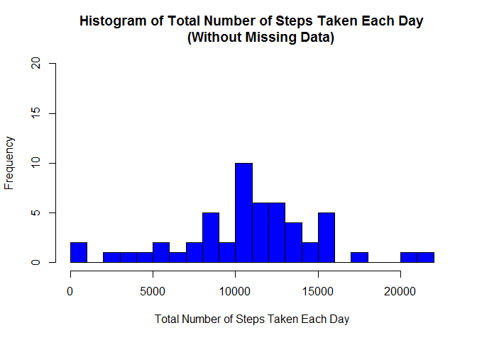
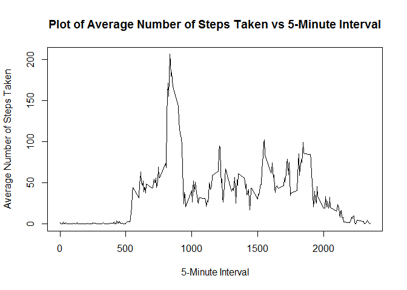
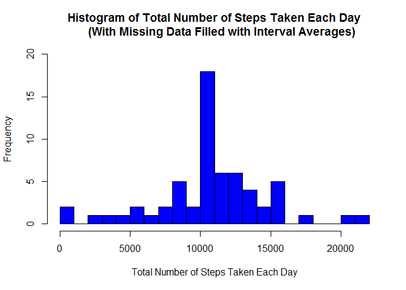
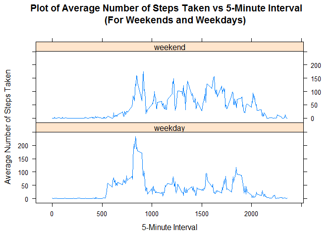

# Reproducible Research: Peer Assessment 1


## Loading and preprocessing the data
1. Load the data

```r
# Set working directory and read activity data
setwd("C:/Users/Alan/Google Drive/R/Coursera/RepData_PeerAssessment1")
unzip(zipfile = "activity.zip")
activity <- read.csv(file = "activity.csv", sep = ",", dec = ".")
```

2. Process/transform the data

```r
# Convert date column to class "Date"
activity$date <- as.Date(activity$date, format = "%Y-%m-%d")
```


## What is mean total number of steps taken per day?
1. Make a histogram of the total number of steps taken each day

```r
# Aggregate the activity data by steps per day 
# (aggregate omits missing values by default)
activity.daily <- aggregate(steps~date, activity, sum)

# Plot histogram
hist(activity.daily$steps, breaks = seq(0, 22000, 1000), 
     xlab = "Total Number of Steps Taken Each Day", col = "blue",
     main = "Histogram of Total Number of Steps Taken Each Day
     (Without Missing Data)",
     ylim = range(0:20))
```

 

2. Calculate and report the **mean** and **median** total number of steps taken per day

```r
mean(activity.daily$steps)
```

```
## [1] 10766.19
```

```r
median(activity.daily$steps)
```

```
## [1] 10765
```
+ The **mean** total number of steps taken per day is 
10766 steps.
+ The **median** total number of steps taken per day is
10765 steps.


## What is the average daily activity pattern?
1. Make a time series plot (i.e. `type = "l"`) of the 5-minute interval (x-axis) and the average number of steps taken, averaged across all days (y-axis)

```r
# Aggregate the activity data by steps per 5-minute interval 
# (aggregate omits missing values by default)
activity.intervals <- aggregate(steps~interval, activity, mean)

# Plot graph
plot(x = activity.intervals$interval, y = activity.intervals$steps,
     xlab = "5-Minute Interval", 
     ylab = "Average Number of Steps Taken", 
     main = "Plot of Average Number of Steps Taken vs 5-Minute Interval",
     type = "l")
```

 

2. Which 5-minute interval, on average across all the days in the dataset, contains the maximum number of steps?

```r
activity.intervals$interval[which.max(activity.intervals$steps)]
```

```
## [1] 835
```
+ The 5-minute interval 
     835
      contains on average the maximum number of steps.


## Imputing missing values
1. Calculate and report the total number of missing values in the dataset (i.e. the total number of rows with `NA`s)

```r
sum(is.na(activity$steps))
```

```
## [1] 2304
```
+ A total of 2304 rows are missing in the dataset.

2. Create a new dataset that is equal to the original dataset but with the missing data filled in with the mean for that 5-minute interval.

```r
# Create 'activity.filled' that is a copy of activity
activity.filled <- activity

# Create function 'fill.steps' that will retrieve the average number of steps 
# for that 5-minute interval
fill.steps <- function(x) {
     activity.intervals[activity.intervals$interval == x, ]$steps
}

# Replace NA values with the average number of steps for the 5-minute interval
for(i in 1:nrow(activity.filled)) {
     if(is.na(activity.filled$steps[i])) {
          activity.filled$steps[i] <- fill.steps(activity.filled$interval[i])
     }
}
```

3. Make a histogram of the total number of steps taken each day and calculate and report the **mean** and **median** total number of steps taken per day. Do these values differ from the estimates from the first part of the assignment? What is the impact of imputing missing data on the estimates of the total daily number of steps?

```r
# Aggregate the filled activity data by steps per day 
activity.filled.daily <- aggregate(steps~date, activity.filled, sum)

# Plot histogram
hist(activity.filled.daily$steps, breaks = seq(0, 22000, 1000),
     xlab = "Total Number of Steps Taken Each Day", col = "blue",
     main = "Histogram of Total Number of Steps Taken Each Day
     (With Missing Data Filled with Interval Averages)",
     ylim = range(0:20))
```

 


```r
mean(activity.filled.daily$steps)
```

```
## [1] 10766.19
```

```r
median(activity.filled.daily$steps)
```

```
## [1] 10766.19
```
+ The **mean** total number of steps taken per day is 10766 steps after filling the missing data with interval averages. The **mean** value is the same as before filling the missing data with interval averages. Upon further inspection, it was found that the missing data occur on full days. As such, we are effectively replacing the days with missing data with the **mean** total number of steps taken per day. Therefore, the **mean** value does not change.
+ The **median** total number of steps taken per day is 10766 steps after filling the missing data with interval averages. The **median** total number of steps taken per day is now the same as the **mean**. By replacing the days with missing values with the **mean** for the whole duration, we have introduced 8 days with the **mean** total number of steps taken per day. This causes the **median** to shift towards the **mean**.


## Are there differences in activity patterns between weekdays and weekends?
1. Create a new factor variable in the dataset with two levels -- "weekday" and "weekend" indicating whether a given date is a weekday or weekend day.

```r
# Use the function 'is.weekend' in the 'chron' package
library(chron)

# Add a column 'day' with either 'weekday' or 'weekend'
for(i in 1:nrow(activity)) {
     if(is.weekend(activity$date[i])) {
          activity$day[i] <- "weekend"
     } else {
          activity$day[i] <- "weekday"
     }
}

# Make 'day' a factor with two levels
activity$day <- factor(activity$day)
```

2. Make a panel plot containing a time series plot (i.e. `type = "l"`) of the 5-minute interval (x-axis) and the average number of steps taken, averaged across all weekday days or weekend days (y-axis).

```r
# Aggregate the activity data by steps per 5-minute interval and by day
# (aggregate omits missing values by default)
activity.intervals.days <- aggregate(steps~interval+day, activity, mean)

# Plot using the lattice package
library(lattice)
xyplot(steps ~ interval | day, activity.intervals.days, type = "l", layout = c(1, 2),
       xlab = "5-Minute Interval",
       ylab = "Average Number of Steps Taken",
       main = "Plot of Average Number of Steps Taken vs 5-Minute Interval
       (For Weekends and Weekdays)")
```

 

+ From the above plot, the average number of steps taken appears to differ from weekends to weekdays. 
+ Note that the original dataset is used for this analysis as the approach of filling the missing data with interval averages will introduce bias and make the two plots appear more similar.
